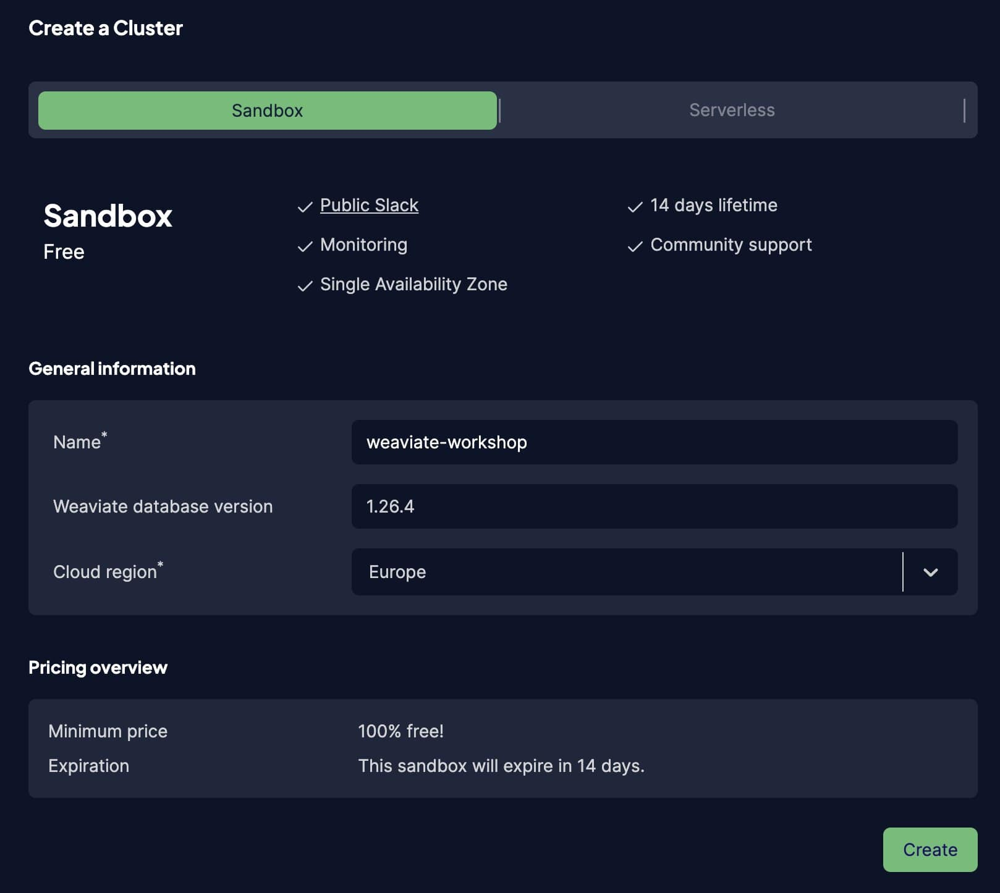
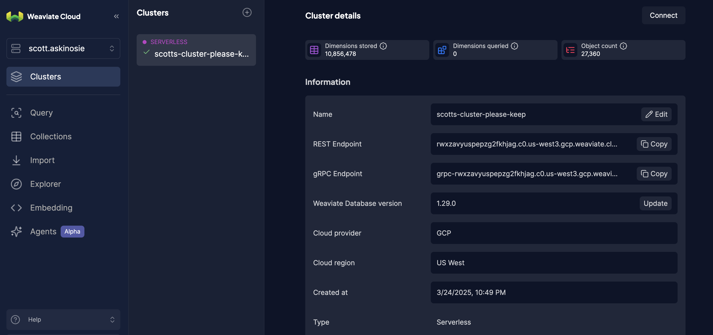
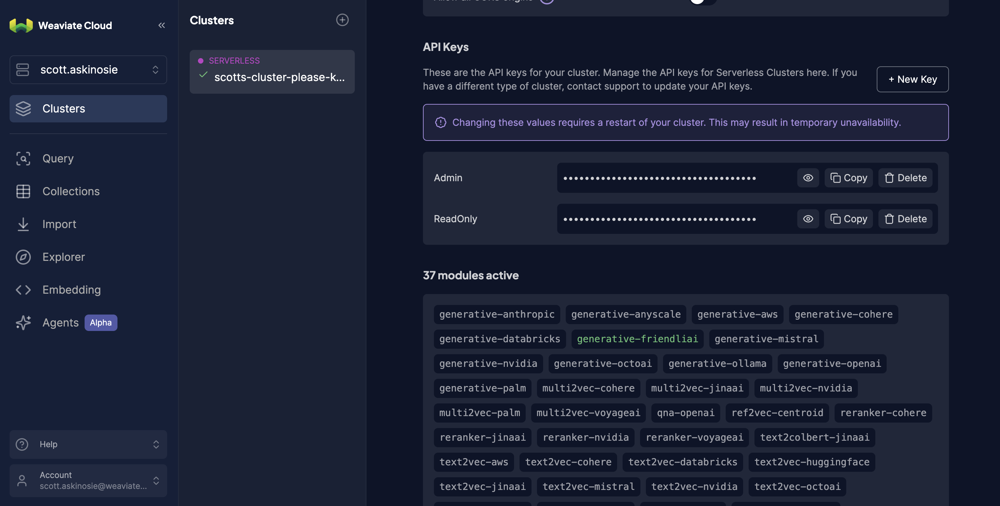

# CalibrateAI-5-12-25

## What you need for the workshop

* A (free) Weaviate Cloud (WCD) account
* A cluster set up in WCD
* The REST endpoint for your cluster
* Your cluster Admin API key
* An OpenAI API key

## Create a Weaviate Cloud instance

  * Head to [Weaviate Cloud console](https://console.weaviate.cloud/) and log in, or create a new account.
  * Create a free `Sandbox` cluster. Give it a name, select the cloud region and press "Create".

 * Collect your REST endpointe and ADMIN API key.

